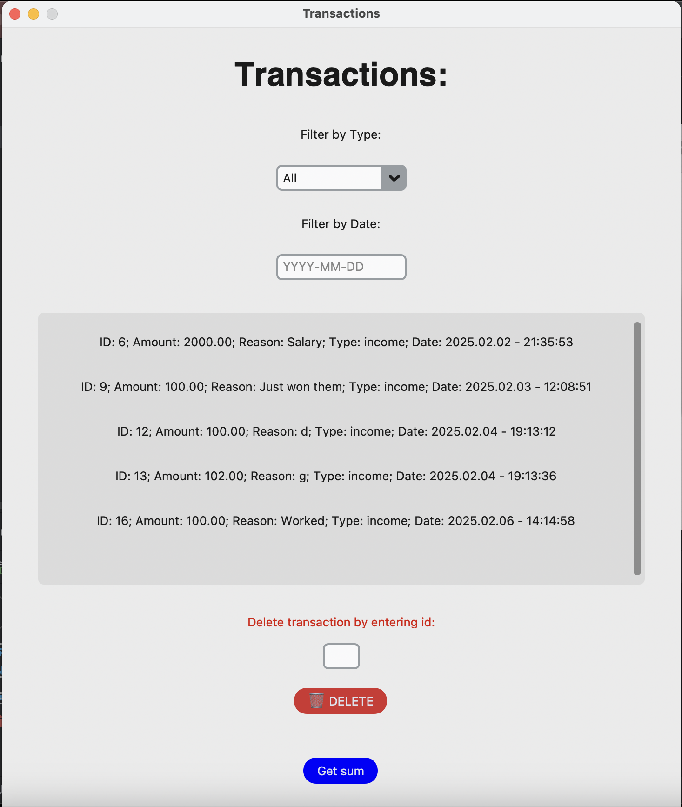
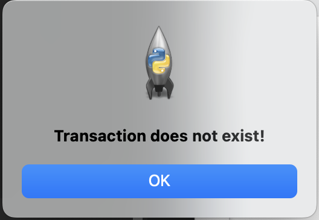

# FinFlow

Fin Flow is a simple yet powerful personal finance management application built using `CustomTkinter` 
for the GUI and `PostgreSQL` for database management. This application allows users to track their 
income and expenses efficiently.

## Features

- **Add Transactions**: Easily record income and expenses.
- **Transaction History**: View past transactions with filtering options.
- **Filter Transactions**: Sort records by type (Income, Expense) or date.
- **Delete Transactions**: Remove records by entering the transaction ID.
- **Sum Transactions**: Calculate total income, expenses, or both within a date range.
- **Dark/Light Mode**: Toggle between dark and light themes for better visibility.
- **Keyboard Shortcuts**: Navigate using keyboard shortcuts like `Enter`, `Esc`, and arrow keys.

## Technologies Used

- **Python** (Programming Language)
- **CustomTkinter** (GUI Framework)
- **Psycopg2** (PostgreSQL Database Connector)
- **Tkinter Messagebox** (User Notifications)

## Installation

### Prerequisites

Ensure you have the following installed:

- **Python 3.x**
- **PostgreSQL Database**
- **Required Python libraries:**


``` shell
pip install customtkinter 
pip intall psycopg2
```

### Database Setup

1. Create a PostgreSQL database named `fin_flow_db`.
2. Use the following SQL command to create the necessary table:

```postgresql
CREATE TABLE transactions (
    id INT GENERATED ALWAYS AS IDENTITY PRIMARY KEY,
    amount NUMERIC(100, 2) NOT NULL,
    reason TEXT NOT NULL,
    type VARCHAR(10) CHECK (type IN ('income', 'expense')) NOT NULL,
    date TIMESTAMP DEFAULT CURRENT_TIMESTAMP
);
```

3. Update the database connection details in `get_connection()`:
```python
return psycopg2.connect(
    dbname="fin_flow_db",
    user="your_username",
    password="your_password",
    host="localhost",
    port="5432"
)
```

## Usage

Run the application using:

```shell
python main.py
```

### Controls

- **Enter**: Submit form fields.
- **Escape (Esc)**: Close windows.
- **Up/Down Arrows**: Navigate between form fields.


## Screenshots

### Main page:
- Light theme:


- Dark theme:


### Transaction page:

- Light theme:



- Dark theme:


- Only income:


- Only expense:


- No transactions:


### Success messages:

- Added the transaction successfully:


- Deleted the transaction successfully:


- Sum of transaction message:


### Error messages:

- Amount is not float or missing:


- No reason field:


- Invalid type of id:


- Error id:



### Choice message:


## License:

This project is licensed under the MIT License.

## Contributors:

- Mario Lupo Ciaponi
- Contributions are welcome! Feel free to submit pull requests.


Developed with ❤️ by Mario Lupo
